# 🔐 Gestión de Variables de Entorno - Infisical

## 📊 Diagrama de flujo

```mermaid
graph TB
    subgraph "DESARROLLO (npm run docker:dev)"
        A[Host ejecuta<br/>infisical run] -->|Inyecta variables| B[Docker Compose]
        B --> C[Contenedor API]
        C --> D[Variables de Infisical = VACÍAS]
        D --> E[App usa variables<br/>del HOST via infisical]
        
        style A fill:#4ade80
        style E fill:#4ade80
    end
    
    subgraph "PRODUCCIÓN (npm run docker:prod)"
        F[Sistema/CI/CD] -->|Variables de entorno| G[Docker Compose]
        G --> H[Contenedor API]
        H --> I[Variables de Infisical = CONFIGURADAS]
        I --> J[App usa variables<br/>del CONTENEDOR]
        
        style F fill:#f87171
        style J fill:#f87171
    end
```



## 🔄 Flujo de variables

### Desarrollo
```bash
# 1. Ejecutas
npm run docker:dev

# 2. Se ejecuta internamente
infisical run --env=dev --path=/sales --cross-env \
  NODE_ENV=development BUILD_TARGET=development \
  docker-compose --profile local-services up --build

# 3. Infisical inyecta las variables desde el HOST
# 4. docker-compose.override.yml sobrescribe las variables de Infisical a vacío
# 5. La app dentro del contenedor recibe las variables del HOST
```

### Producción
```bash
# 1. Ejecutas
npm run docker:prod

# 2. Se ejecuta internamente
docker-compose -f docker-compose.yml up --build api

# 3. Docker Compose lee las variables del sistema (.env o variables de entorno)
# 4. La app dentro del contenedor se conecta a Infisical con sus credenciales
# 5. Infisical devuelve los secretos de producción
```

## 📋 Tabla comparativa

| Aspecto | Desarrollo | Producción |
|---------|-----------|------------|
| **Comando** | `npm run docker:dev` | `npm run docker:prod` |
| **Infisical desde** | Host (via `infisical run`) | Contenedor (via SDK) |
| **Variables de Infisical en contenedor** | Vacías (sobrescritas) | Configuradas (requeridas) |
| **Archivo usado** | `docker-compose.yml` + `docker-compose.override.yml` | Solo `docker-compose.yml` |
| **INFISICAL_CLIENT_ID** | No necesario | ✅ Requerido |
| **INFISICAL_CLIENT_SECRET** | No necesario | ✅ Requerido |
| **INFISICAL_ENV** | No necesario | ✅ Requerido |
| **NEW_RELIC_ENABLED** | `false` | `true` (default) |

## 🛠️ Configuración por archivo

### `docker-compose.yml` (Base - Producción)
```yaml
services:
  api:
    environment:
      # Infisical (solo producción)
      - INFISICAL_MACHINE_IDENTITY_CLIENT_ID=${INFISICAL_CLIENT_ID}
      - INFISICAL_MACHINE_IDENTITY_CLIENT_SECRET=${INFISICAL_CLIENT_SECRET}
      - INFISICAL_ENV=${INFISICAL_ENV}
      - INFISICAL_PROJECT_PATH=${INFISICAL_PROJECT_PATH:-/api}
```

### `docker-compose.override.yml` (Desarrollo)
```yaml
services:
  api:
    environment:
      # Sobrescribe las variables de Infisical a vacío
      - INFISICAL_MACHINE_IDENTITY_CLIENT_ID=
      - INFISICAL_MACHINE_IDENTITY_CLIENT_SECRET=
      - INFISICAL_ENV=
      - INFISICAL_PROJECT_PATH=
      
      # New Relic deshabilitado
      - NEW_RELIC_ENABLED=false
```

### `package.json`
```json
{
  "scripts": {
    "docker:dev": "infisical run --env=dev --path=/sales --cross-env NODE_ENV=development BUILD_TARGET=development docker-compose --profile local-services up --build",
    "docker:prod": "docker-compose -f docker-compose.yml up --build api"
  }
}
```

## ✅ Ventajas de esta configuración

### Desarrollo
- ✅ No necesitas configurar credenciales de Infisical en el contenedor
- ✅ Usas tu sesión de Infisical local (más seguro)
- ✅ Cambios en Infisical se reflejan inmediatamente (sin rebuild)
- ✅ No expones credenciales en archivos `.env`
- ✅ New Relic deshabilitado (menos ruido en logs)

### Producción
- ✅ El contenedor es autónomo (no depende del host)
- ✅ Las credenciales se gestionan via variables de entorno del sistema
- ✅ Compatible con CI/CD (GitHub Actions, GitLab CI, etc.)
- ✅ Más seguro (credenciales solo en producción)
- ✅ New Relic habilitado para monitoreo

## 🚨 Errores comunes

### Error: "Infisical credentials not found" en desarrollo
**Causa**: No has iniciado sesión en Infisical en tu máquina local

**Solución**:
```bash
infisical login
```

### Error: "Infisical credentials not found" en producción
**Causa**: No has configurado las variables de entorno

**Solución**: Configura en tu servidor/CI:
```bash
export INFISICAL_CLIENT_ID=your-id
export INFISICAL_CLIENT_SECRET=your-secret
export INFISICAL_ENV=prod
```

### Error: Variables de desarrollo aparecen en producción
**Causa**: Existe `docker-compose.override.yml` en producción

**Solución**: No incluyas `docker-compose.override.yml` en tu deploy o usa:
```bash
docker-compose -f docker-compose.yml up
```

## 📝 Checklist de configuración

### Para desarrollo
- [ ] Instalar Infisical CLI: `npm install -g @infisical/cli`
- [ ] Iniciar sesión: `infisical login`
- [ ] Ejecutar: `npm run docker:dev`

### Para producción
- [ ] Configurar `INFISICAL_CLIENT_ID` en variables de entorno
- [ ] Configurar `INFISICAL_CLIENT_SECRET` en variables de entorno
- [ ] Configurar `INFISICAL_ENV=prod`
- [ ] (Opcional) Configurar credenciales de New Relic
- [ ] Ejecutar: `npm run docker:prod`
